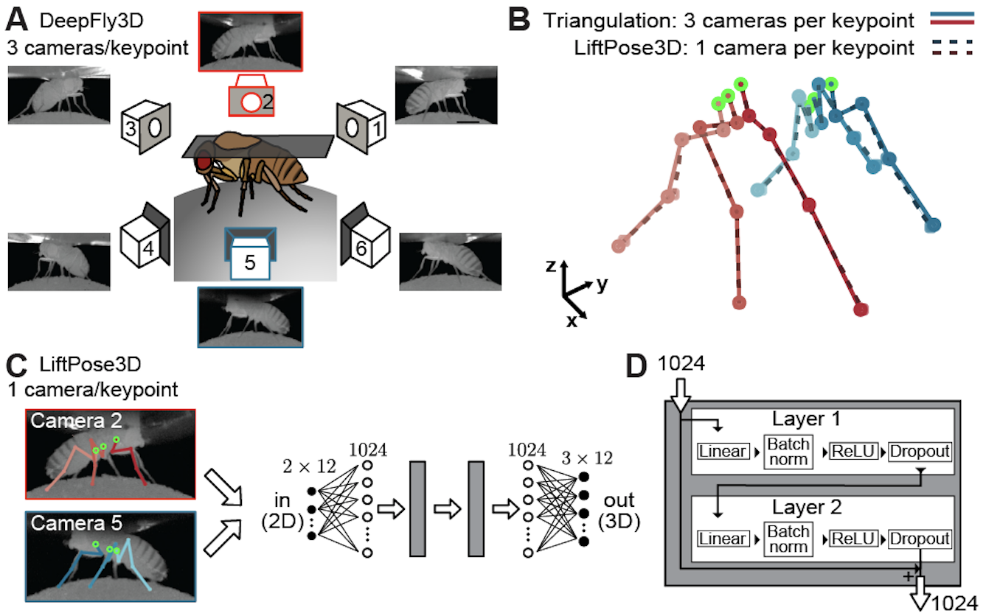
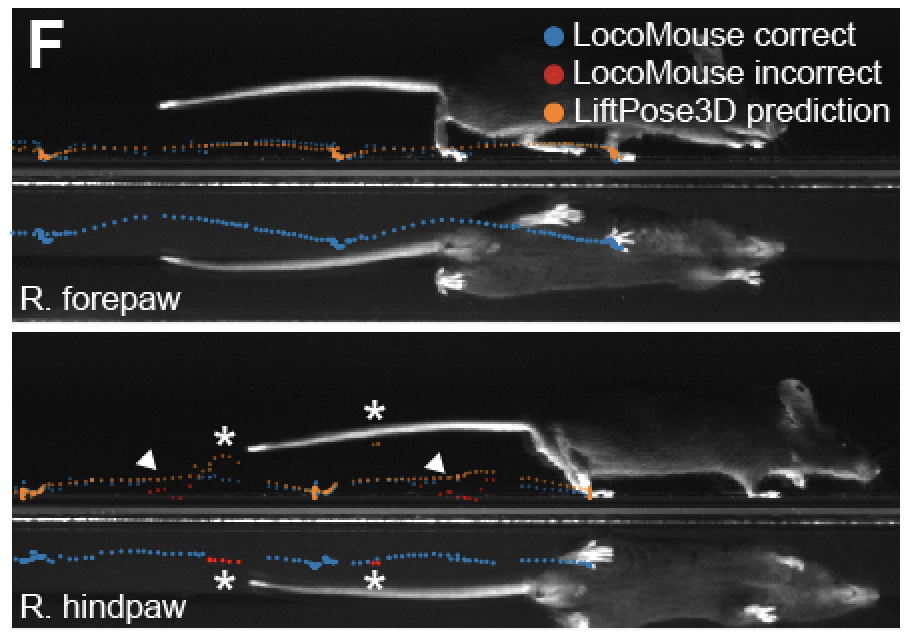
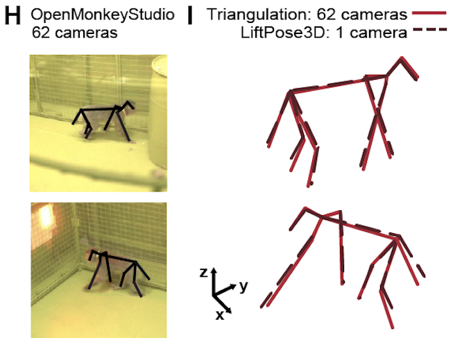
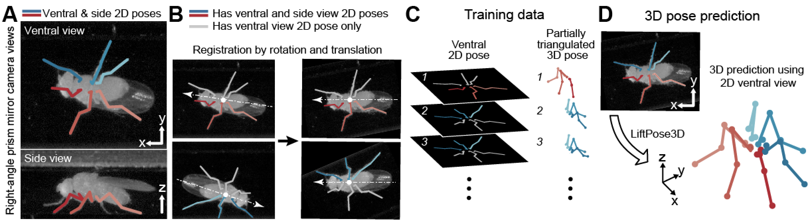
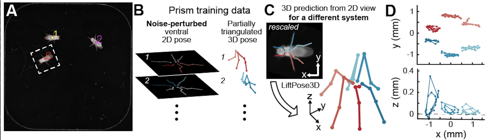

# LiftPose3D
<p align="center">
  
</p>

The tool for transforming 2D keypoints from a single viewpoint to 3D coordinates using deep neural networks.

For the theoretical background and for more details on the following examples have a look at our paper:
[LiftPose3D, a deep learning-based approach for transforming 2D to 3D pose in laboratory experiments](https://www.biorxiv.org/)


Don't forget to cite us if you find our work useful:

```
@inproceedings{GosztolaiGunel20LiftPose3D,
  author    = {Adam Gosztolai and
               Semih Günel and
               Marco Pietro Abrate and
               Daniel Morales and 
               Victor Lobato Rios and
               Helge Rhodin and
               PascalFua and
               Pavan Ramdya},
  title     = {LiftPose3D, a deep learning-based approach for transforming 2D to 3D pose in laboratory experiments},
  bookTitle = {bioRxiv},
  year      = {2020}
}
```

There are only a few steps you should follow to use our code.

## Data format

Ensure that you provide your data as a Python dictionary and saved as a pickle file. Our code uses the following dictionary keys:

**1. 3D poses**: This is the ground truth and it is mandatory if you want to train a network.

```'points3d'```: a numpy array of dimension AxBx3 containing the 3D coordinates in a global reference frame, where A is the number of frames, B is the number of keypoints and the last 3 dimensionss are the x, y, z coordinates. 

**2. 2D poses**: These are typically 2D pose predictions from markerless pose estimation software (DeepFly3D, DeepLabCut, DeepPoseKit etc.). If you use this key, follow example **I** for more details. If you do not use this key, the 2D poses will need to be found by projection in order to train the network. See examples **II** for more details. If you want to use a pretrained network for prediction, you only need this key. See examples **III** for details.

```'points2d'```: a numpy array of dimension CxAxBx2 containing the 2D coordinates in camera centric reference frame, where C is the number of cameras and A, B as before.

**3. Keypoints to be used for training**: If you use this key, you can specify which dimensions at every frame are used for training. See example **II** for more details.

```'good_keypts'```: boolean array of dimension AxBx3, where an entry 1 means that the coordinate is to be used for training, 0 means it is to be ommitted from training.

**4. Camera parameters**: parameters of cameras used during training. If this is not used, then projections will be onto the Cartesian axes. See examples **II**.

```n``` (where n is the camera number): a dictionary with keys 'R' (3x3 rotation matrix), 'tvec' (1x3 translation vector), 'vis' (1x#number of dimensions boolean vector of visible points from camera n)

Refer to files in ```/sample data``` folder for examples.

## Configuration file

To run the pipeline, the following parameters need to be defined in a file named ```params.yaml```, or similar.

**Mandatory**:
- [x] *data_dir*: folder to load data from (e.g., '/data/LiftPose3D/fly_ventral_highres/network/')
- [x] *in_dim*: input dimension (typically 2)
- [x] *out_dim*: output dimension (typically 1 - depth only - or 3 - full 3D)
- [x] *target_sets*: dependent keypoints to compute relative to a root (e.g., [[ 1,  2,  3,  4],  [6,  7,  8,  9]])
- [x] *roots*: root points (e.g., [0, 5], length must equal to the length of target_sets)

**Optional**:
- [ ] *train_subjects*: individuals used for training (string to seach for in filenames)
- [ ] *test_subjects*: individuals used for testing (string to seach for in filenames)
- [ ] *actions*: behaviors used (string to seach for in filenames)
- [ ] *template_dir*: '/data/LiftPose3D/fly_ventral_highres/network/'
- [ ] *interval*: interval of frames to consider (e.g., [400,800])
- [ ] *dims_to_exclude*: keypoint dimensions to ignore in dataset (e.g., [4,7,8])

## Preprocessing 

Every example below contains preprocessing as the first step. If you want to train a network, preprocessing needs to contain the following operations (1) load 3D data - output, (2) load 2D data or project 3D data - input, (3, optional) transform from 3D points in world to camera axes - when using multiple cameras, (4) compute the the distance of dependent points (target_sets) from root points (roots), (5) standardize, (6) remove roots.

You can use or modify one of our existing ```LiftPose3D_preprocess.py``` scripts in the example folders.

To run preprocessing in the following, execute your 

```python LiftPose3D_preprocess.py params.yaml```. 

## Network training

After preprocessing, you are ready for training and testing your network or you can just use a pre-trained network for prediction.

To train a network, run

```python LiftFly3D_main.py --data_dir /directory_to_save_output --out /directory_to_save_output```

This will output a ```ckpt_best.pth.tar``` (lowest error network) as well as a ```log_train.txt``` (a log file containing errors during the training)

To test the network, run

```python 2_LiftFly3D_main.py --data_dir /directory_to_save_output --out /directory_to_save_output --test --load /directory_to_save_output/ckpt_best.pth.tar```

The output will be saved as ```test_results.pth.tar```.

To predict using a pre-trained network (when you don't have a training dataset), run

```python 2_LiftFly3D_main.py --data_dir /directory_to_save_output --out /directory_to_save_output --predict --load /directory_to_save_output/ckpt_best.pth.tar```

The output will be saved as ```test_results.pth.tar```.

To add a Gaussian noise during training add ```--noise 3```, where 3 is the standard deviation of the noise. This can be used to scale the resolution of the network, see examples **III** for mode details.

Refer to ```/src/opt.py``` for more options. 

## Examples

<p align="center">
  
</p>

To reproduce our results in the following examples, the provided Python scripts must be run in order as numbered. 

### I. Reducing the number of cameras needed for full 3D pose estimation

<p align="center">
  
</p>

The relevant code is under the folder ```/examples/fly_tether``` and ```/examples/monkey```.

### II. Predicting 3D pose in freely behaving animals with occluded keypoints

<p align="center">
  
</p>

The relevant code is under the folder ```/examples/fly_prism``` and ```/examples/mouse_prism```.

You can ignore 1-2 and use our data directly.

1. ```1_crop_raw_images``` - this script makes cropped images centred around the moving fly. Images where the fly is starionary are excluded. The location of each crop is saved.
2. ```2_DLC_lateral.ipynb``` and ```2_DLC_ventral.ipynb``` - jupyter notebooks used to create DeepLabCut annotations for the ventral and lateral camera views.
3. ```3_select_good_predictions.ipynb``` - this jupyter notebook selects high quality predictions for training and testing. Check out the options inside the notebook.
4. ```4_DLC_make_video.ipynb``` - makes video of the DeepLabCut predictions

The rest of the scripts follow the same protocol as in the above example.
1
### III. Using domain adaptation to lift new experimental data where triangulation is impossible
<p align="center">
  
</p>
The relevant code is under the folder ```/examples/fly_ventral_highres``` and ```/examples/fly_ventral_lowres```.

1. ```1_DLC_to_LiftPose3D.ipynb``` - converts DeepLabCut predictions into LiftPose3D format and aligns the flies as in examples **II**. Importantly, it performs a rescaling to match the scales between the prism-mirror and the ventral camera datasets. This step is crucial and may need to be adjusted manually to get a good alignment of the datasets.
2. ```2_LiftPose3D_preprocess.py``` - this preprocessing is slightly different from before because it uses the statistics of the prism-mirror setup to normalize the data.
3. Train a network using the prism-mirror dataset. When training for the low resolution dataset, use the option ```--noise 4```, to add a Gaussian noise with standard deviation 4 during training. Adding this option is essential to coarse-grain our network to work with data that has lower resolution than the training dataset. As a rule of thumb, std should be equal to the ratio between the high and low resolution datasets. For example, our training data is at 112 px/mm and out test data is at 28 px/mm to std should be at least 4.
\
*Example*: in ```/examples/fly_prism``` run ```python 6_LiftFly3D_main.py --data_dir /data/LiftPose3D/fly_prism/ --out /data/LiftPose3D/fly_ventral_lowres/ --noise 4 --epochs 500```

4. Predict the 3D points using the trained network.
\
*Example*: in ```/examples/fly_prism``` run ```python 6_LiftFly3D_main.py --data_dir /data/LiftPose3D/fly_ventral_lowres/ --out /data/LiftPose3D/fly_ventral_lowres/ --predict --load /data/LiftPose3D/fly_ventral_lowres/ckpt_best.pth.tar```
